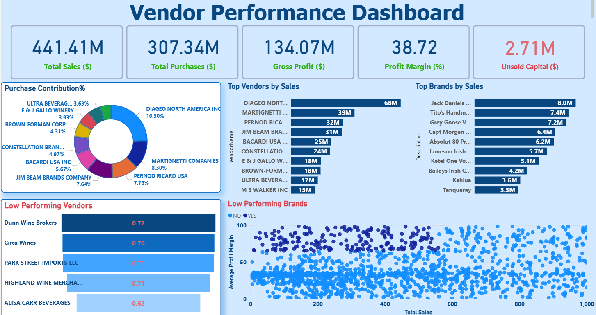

# Vendor-Performance-Data-Analysis-End-to_End-Project
End to End Project of data analysis using Python, SQL and Power BI

This project gives insights about vendors peroformance for a particular year

INCLUDES: EDA & ETL USING Python & SQL

--> [ETL - Created database and ingested data files into database using Python script](data_ingestion_script.ipynb)

--> [EDA- Exploring data tables for better understanding, unique value columns, inefficiencies, duplicacy,data_types, formatting, null or missing values and created SQL query for summary table extracting data from various data tables](Exploratory_data_analysis.ipynb)

--> [ANALYSIS-Here we analysed data using python answered business research questions and derived business insights and recommendations - pandas, numpy, matplotlib, seaborn, statistics methods, hypothesis technique](Vendor_Performance_Analysis.ipynb)

--> [This includes all the summary of research and analyis - key data points, charts , findings and business recommendations](Business_Report.docx)

See the full dashboard here - [Online View Link](https://app.powerbi.com/view?r=eyJrIjoiNWNiMGFhYjUtM2NkMS00YjkxLTk5ZjQtNDczYTUxMTcxOWU4IiwidCI6Ijc0NGQ1YTFmLWU1YTAtNDU5Ni1hNTNiLWZjMjM3MzdhOWYwOCJ9)

